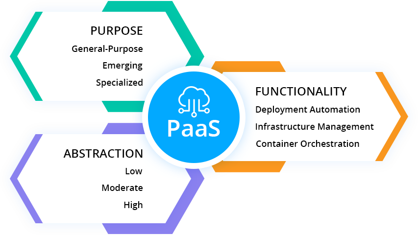

## What is PaaS?

Platform as a service (PaaS) is a category of cloud computing 
services that provides a platform allowing customers to develop, 
run, and manage applications without the complexity of building 
and maintaining the infrastructure typically associated with 
developing and launching an app.

### What AWS Amplify is?
AWS Amplify is a set of purpose-built tools and features that lets 
frontend web and mobile developers quickly and easily build 
full-stack applications on AWS, with the flexibility to 
leverage the breadth of AWS services as your use cases evolve.
With Amplify, you can configure a web or mobile app backend, 
connect your app in minutes, visually build a web frontend UI, 
and easily manage app content outside the AWS console. Ship 
faster and scale effortlessly—with no cloud expertise needed.

### Steps :
1. Login to the AWS console
2. Find for AWS Amplify in the services.
3. Get Started with Amplify service.
4. Click on Host a Web App.
5. Then choose to launch it with Github and authenticate your GitHub account for the same..
6. After that choose the Repository containing your source code ( subfolder if needed)
7. Then Launch the application with the default configurations provided by [AWS Amplify](https://aws.amazon.com/amplify/#:~:text=AWS%20Amplify%20is%20a%20set,as%20your%20use%20cases%20evolve.)
8. Configurations may be different on type of framework / technology you are launching your application ( **REACT is my case** ).
### Done..!! You have launched your app successfully